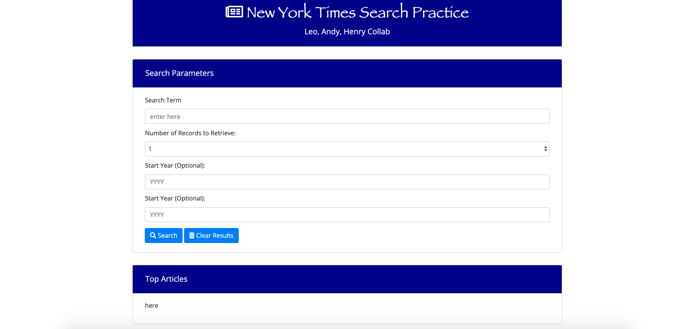

# NYT-PRACTICE
This project is intended to allow the user to search for articles published by the New York Times by title and year.

# Instructions

1. Type keywords into search term input field
2. Select number of records to retrieve (1, 5, or 10)
3. Select a start and end year of when the articles were written (optional)
4. Results of the search will be populated in the Top Articles section
5. Clear results button will only clear the populated results in the Top Articles

# Link

